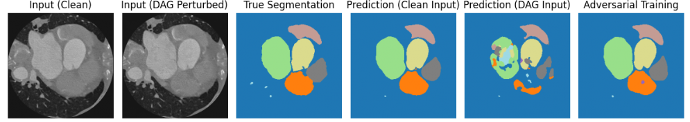

# robust-heart-segmentation

Robust segmentation of cardiac structures from CT images is
essential for accurate diagnosis and treatment planning in cardiovascular
disease. While deep learning models such as U-Net and its transformer-based variants have demonstrated strong performance, their vulnerability to noise and adversarial perturbations poses a challenge for clinical
reliability. In this work, we investigate the adversarial robustness of 2D
semantic segmentation models for whole heart segmentation using CT
data from the MMWHS dataset. We benchmark a standard U-Net and an
attention-guided TransAttUNet architecture under adversarial attacks
including the Fast Gradient Sign Method (FGSM) and Dense Adversarial
Generation (DAG). We evaluate adversarial training strategies applied
separately using FGSM or DAG examples to improve model robustness.
Our results show that DAG-based adversarial training leads to the high-
est robustness, particularly when applied to the transformer-based ar-
chitecture. Introducing a consistency loss between attention maps under
clean and perturbed inputs yielded stable but not superior performance.
These findings highlight the value of DAG adversarial training in en-
hancing the trustworthiness of medical segmentation models and suggest
that transformer-based architectures benefit the most from this strategy
in adversarial settings, and offer practical training techniques to improve
the reliability of segmentation models in real-world clinical scenarios.

# Results

This table summarizes the performance of all models on clean data and under adversarial perturbations (FGSM and DAG). The reported metric is the mean Dice score across the 7 foreground classes. The baseline U-Net achieves strong segmentation on clean images (Dice = 0.9290), but its performance drops significantly under FGSM (Dice = 0.8259) and DAG (Dice = 0.7283) attacks.

| **Model**                             | **Dice (Clean)** | **Dice (FGSM)** | **Dice (DAG)** |
|--------------------------------------|------------------|------------------|----------------|
| U-Net                                | **0.9290**       | 0.8259           | 0.7283         |
| U-Net + FGSM                         | 0.9239           | **0.8937**       | 0.8564         |
| U-Net + DAG                          | 0.9119           | 0.8463           | 0.8760         |
| TransAttUNet                         | 0.9291           | 0.8170           | 0.6855         |
| Transformer + DAG                    | 0.9183           | 0.8530           | **0.8902**     |
| Transformer + DAG + Consistency      | 0.9175           | 0.8537           | 0.8892         |

This figure provides a visual comparison of segmentation performance under clean and DAG-perturbed inputs for a representative CT slice. The first two panels show the clean and adversarially perturbed input images, followed by the ground truth segmentation. The next two panels display predictions from a model trained without adversarial robustness, revealing strong alignment with the ground truth on clean input, but substantial degradation under DAG perturbation. The final panel shows the prediction from a model trained with DAG-based adversarial training, which restores spatial consistency and segmentation accuracy despite the attack. This example highlights the vulnerability of standard models to adversarial perturbations and demonstrates how robust training can mitigate their impact and enhance model reliability in safety-critical settings.

# Conclusions

This work investigated the robustness of 2D semantic segmentation models for cardiac CT images against adversarial attacks. Using the MMWHS dataset, we benchmarked a standard U-Net and a transformer-based U-Net under clean conditions and under adversarial perturbations from FGSM and DAG. To improve robustness, we applied adversarial training using examples generated by each attack method. We also evaluated a consistency loss based on attention map alignment to encourage stable internal representations.

Our results show that adversarial training with DAG significantly improves robustness, especially when applied to the transformer-based model. While consistency loss maintained performance, it did not lead to further improvement. These findings highlight the value of combining transformer architectures with targeted adversarial training to enhance the reliability of medical segmentation models. Future work could explore uncertainty estimation, test-time adaptation, and the extension of these methods to 3D volumes and multi-modal imaging.
